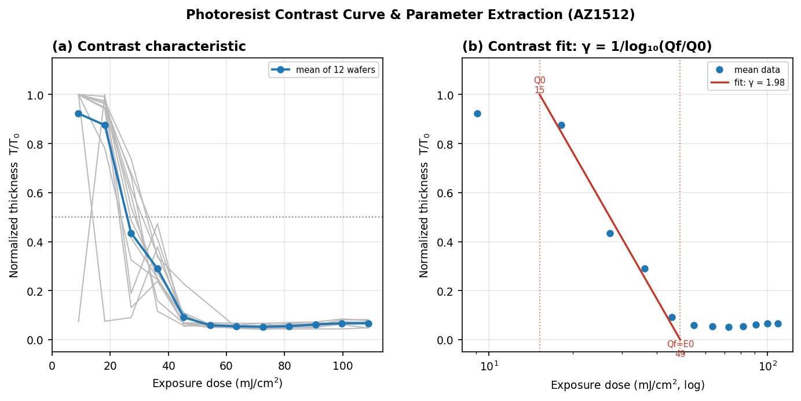

# Photoresist Contrast-Curve Characterization (AZ1512)

Measured the exposure–development response of **AZ1512 positive photoresist** across
12 wafers and extracted the two figures of merit that define a lithography process
window — resist **contrast (γ)** and **dose-to-clear (E₀)** — plus coat uniformity
and wafer-to-wafer dose variation, all from wafer-level metrology.



## Key results

| Parameter | Value | Meaning |
|---|---|---|
| Contrast **γ** | **1.98** | slope of the clearing transition |
| Onset dose **Q₀** | 15.2 mJ/cm² | extrapolated full-thickness intercept |
| Dose-to-clear **E₀ (Q_f)** | **48.6 mJ/cm²** | dose that fully clears the film |
| Wafer-to-wafer **D₅₀** | 26.8 ± 5.1 mJ/cm² | dose at 50% remaining (19% spread) |
| Coat uniformity **T₀** | 1.091 ± 0.062 µm | 5.7% 1σ across 12 wafers |
| Exposure margin | E₀ = 45% of working dose | ~2.2× headroom at 108.8 mJ/cm² |

## Method

- **Coat / bake:** AZ1512 spin-coated on SiO₂/Si, soft-baked.
- **Expose:** contact aligner at 32 mW/cm², 12 evenly spaced dose steps
  (longest = 3.4 s = 108.8 mJ/cm²), replicated across 12 wafers.
- **Develop:** TMAH (AZ 300 MIF), then post-develop rinse and dry.
- **Measure:** Filmetrics reflectometry of remaining resist thickness
  (227/229 fits valid, median GOF 0.99).
- **Analyze:** `contrast_curve_drive.py` pulls the metrology export from Google
  Drive, rejects low-quality fits, normalizes each wafer to its unexposed
  thickness T₀, and fits normalized thickness vs. log₁₀(dose) over the clearing
  transition. γ = −slope = 1 / log₁₀(Q_f/Q₀).

## Run it

```bash
pip install pandas openpyxl requests numpy matplotlib
python contrast_curve_drive.py
```

The script downloads the data from Google Drive (the sheet must stay shared
"Anyone with the link"). The same workbook is committed here
(`20260317_PR_Expose_time_Experiment.xlsx`) so the analysis is fully
reproducible offline — point the script at the local file if you prefer.

## Files

| File | Description |
|---|---|
| `contrast_curve_drive.py` | analysis + plotting pipeline |
| `20260317_PR_Expose_time_Experiment.xlsx` | raw Filmetrics thickness export |
| `contrast_curve.png` | two-panel result figure |
| `photoresist_contrast_onepager.pdf` | one-page write-up |
